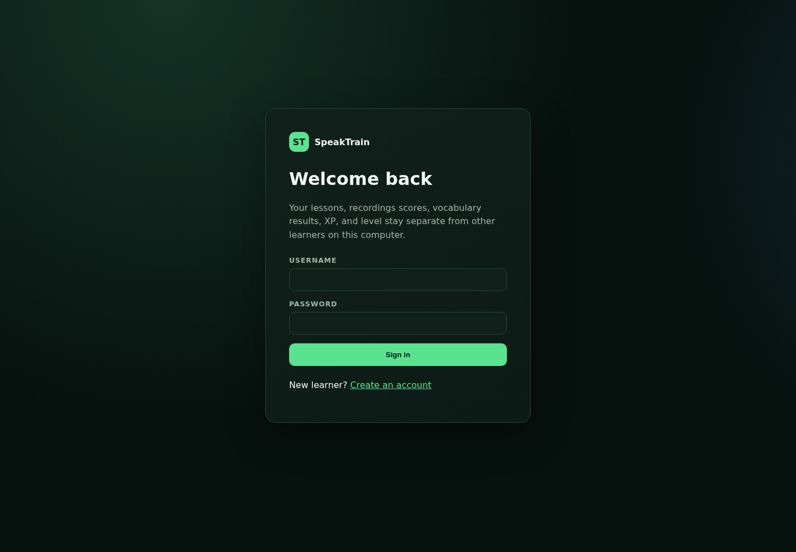
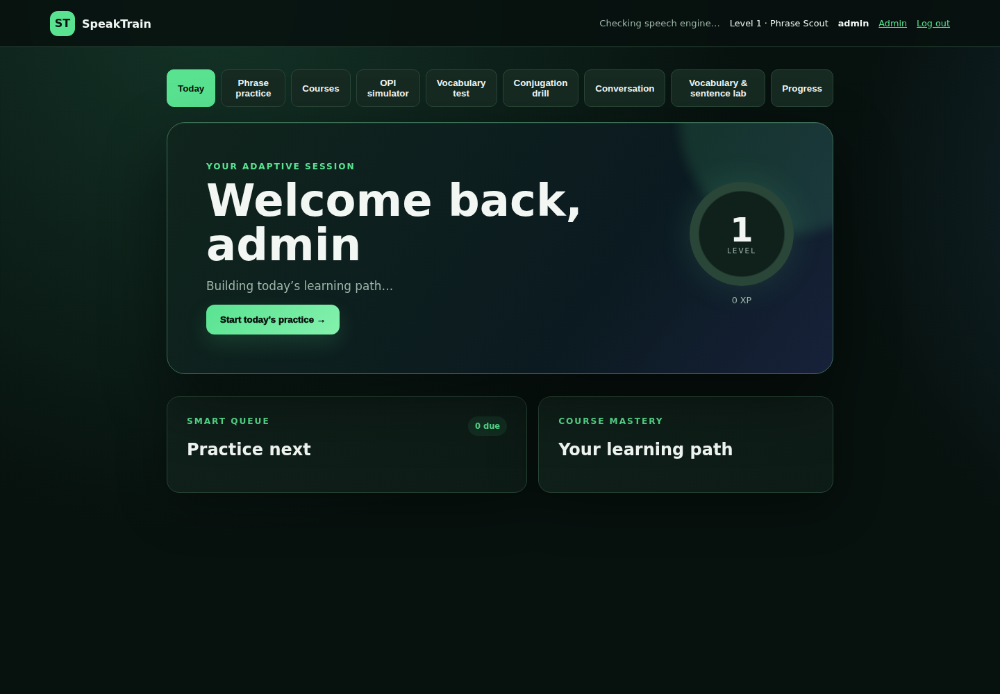
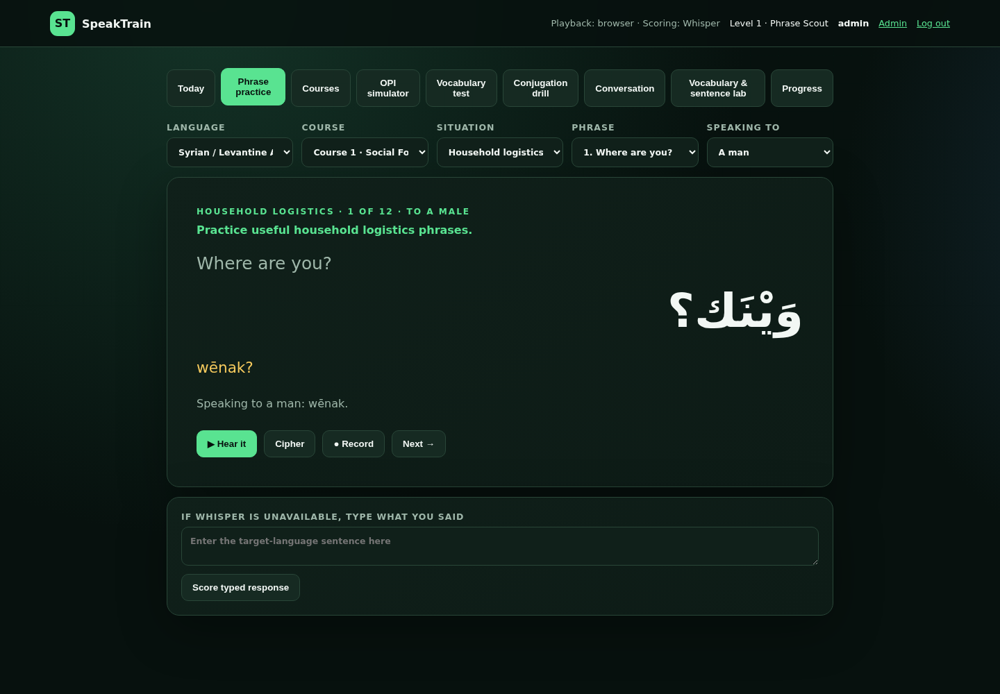
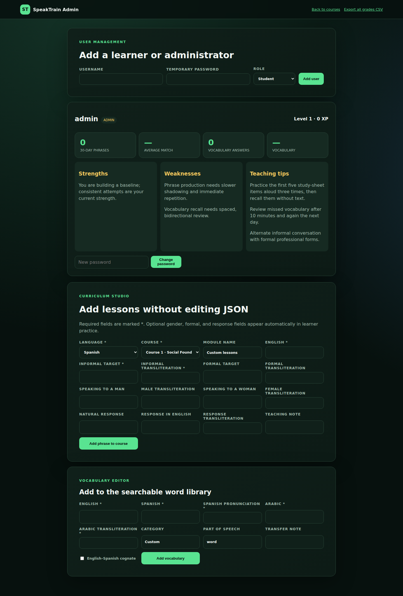

# SpeakTrain

[](https://github.com/iamrichmack111/SpeakTrain/actions/workflows/ci.yml)
[](https://github.com/iamrichmack111/SpeakTrain/actions/workflows/codeql.yml)
[](https://github.com/iamrichmack111/SpeakTrain/pkgs/container/speaktrain)
[](https://www.python.org/)
[](LICENSE)

SpeakTrain is a local-first, adaptive speaking trainer for conversational Spanish and Syrian/Levantine Arabic. It connects phrase recall, masculine/feminine Arabic, formal/informal registers, transliteration, conjugation, cognate bridges, guided conversation, storytelling, OPI-style practice, local speech recognition, spaced repetition, grades, and curriculum administration in one Flask application.

> SpeakTrain’s mastery levels and OPI estimates are training indicators. They are not official CEFR, ACTFL, OPI, or ILR certifications.

## Why SpeakTrain

Most language tools separate vocabulary, grammar, pronunciation, and conversation. SpeakTrain makes them one learning loop:

1. See today’s due items.
2. Recall or speak before revealing the answer.
3. Receive transcription/recall feedback.
4. Move from New → Learning → Familiar → Strong → Mastered.
5. Review again after roughly 10 minutes, 1, 3, 7, 14, or 30 days.
6. Reuse the same material in conjugation, guided conversation, sentence building, and OPI practice.


## Highlights

- Adaptive Today dashboard and per-user spaced repetition.
- Four progressive courses with 76 built-in phrases.
- Syrian Arabic and formal MSA alternatives.
- Masculine/feminine forms such as `shū ismak?` and `shū ismik?`.
- Spanish `tú/usted` register practice.
- Transliteration, syllable ciphers, browser/Piper audio, and Faster Whisper scoring.
- Searchable 36-item trilingual lexicon plus administrator-added vocabulary.
- English → Spanish cognates and Spanish ↔ Arabic meaning bridges.
- Eight Spanish and eight Syrian Arabic verbs with 192 person/tense forms.
- Compatible-complement sentence builder with negatives and questions.
- Conjugation quizzes, guided conversations, and OPI-style prompts.
- Local accounts, XP, grades, strengths, weaknesses, printable reports, and CSV export.
- Administrator Curriculum Studio—no JSON editing required.
- Docker, multi-architecture GHCR publishing, CodeQL, Dependabot, D2, and Playwright.

## Screenshots

Playwright creates these images from a fresh isolated `admin / admin` fixture and refreshes them automatically on `main`.

| Login | Adaptive dashboard |
|---|---|
|  |  |

| Phrase practice | Admin Curriculum Studio |
|---|---|
|  |  |

All twelve captures are documented in [`docs/screenshots`](docs/screenshots) and uploaded with the Playwright HTML report in CI.

## Architecture


- Flask serves HTML and JSON APIs.
- SQLite stores users, attempts, mastery schedules, custom curriculum, and grades.
- Version-controlled JSON provides the built-in courses, forms, lexicon, conjugations, and bridge vocabulary.
- Browser speech works immediately; Piper and Faster Whisper are optional local enhancements.
- Editable, icon-based D2 sources live in [`docs/diagrams`](docs/diagrams).

## Requirements

### Core application

- Python 3.10 or newer; Python 3.12 recommended.
- A modern browser with microphone permission for recording.
- Approximately 100 MB disk space for the base application and environment.

### Optional capabilities

- Node.js 24 and npm for Playwright.
- Chromium installed by Playwright for browser tests/screenshots.
- Faster Whisper for local transcription; model downloads require additional disk space.
- Piper executable plus Arabic/Spanish voice models for local reference audio.
- Docker 24+ and Compose v2 for containers.
- D2 for editing/rendering architecture diagrams.

## Quick start

```bash
git clone git@github.com:iamrichmack111/SpeakTrain.git
cd SpeakTrain

python3 -m venv .venv
source .venv/bin/activate
python -m pip install --upgrade pip
python -m pip install -r requirements.txt

python app.py
```

Open <http://127.0.0.1:8095>. Register the first account; it becomes the administrator.

### Windows PowerShell

```powershell
py -3.12 -m venv .venv
.venv\Scripts\Activate.ps1
python -m pip install --upgrade pip
python -m pip install -r requirements.txt
python app.py
```

## Enable local Whisper scoring

Use Python 3.10–3.13 if your newest Python release does not yet have compatible speech wheels.

```bash
source .venv/bin/activate
python -m pip install -r requirements-speech.txt
export WHISPER_MODEL=small
python app.py
```

Whisper measures recognized words, not phoneme-level accent quality. One-word samples are intentionally excluded from WPM.

## Enable Piper voices

```bash
export PIPER_MODEL_ES=/absolute/path/to/spanish.onnx
export PIPER_MODEL_AR=/absolute/path/to/arabic.onnx
python app.py
```

Generated WAV files are cached under the ignored `instance/audio/` directory.

## Configuration

| Variable | Default | Purpose |
|---|---|---|
| `SPEAKTRAIN_HOST` | `0.0.0.0` | Bind address |
| `SPEAKTRAIN_PORT` | `8095` | HTTP port |
| `SPEAKTRAIN_DATABASE` | `instance/speaktrain.sqlite3` | SQLite database path |
| `SPEAKTRAIN_SECRET_KEY` | development fallback | Session signing; replace in production |
| `SPEAKTRAIN_DEBUG` | `0` | Set to `1` only for local debugging |
| `WHISPER_MODEL` | `base` | Faster Whisper model |
| `PIPER_MODEL_ES` | unset | Spanish Piper model path |
| `PIPER_MODEL_AR` | unset | Arabic Piper model path |

## Docker

### Published image

```bash
docker pull ghcr.io/iamrichmack111/speaktrain:v0.6.0

docker run --rm -p 8095:8095 \
  -e SPEAKTRAIN_SECRET_KEY="$(openssl rand -hex 32)" \
  -v speaktrain-data:/data \
  ghcr.io/iamrichmack111/speaktrain:v0.6.0
```

### Build locally

```bash
docker build -t speaktrain:v0.6.0 .
docker compose up --build
```

The container runs as a non-root user, uses Gunicorn, persists `/data`, and exposes `/healthz`. Tagged releases publish `v0.6.0`, `0.6`, `latest`, and SHA tags for `linux/amd64` and `linux/arm64` with build provenance.

## Tests

### Python

```bash
source .venv/bin/activate
python -m pip install -r requirements-dev.txt
pytest -q
```

### Playwright and screenshots

```bash
npm ci
npx playwright install chromium
PYTHON_EXECUTABLE=.venv/bin/python npm run test:e2e
```

The test server deletes and recreates only `instance/playwright.sqlite3`, then seeds `admin / admin`. Those credentials are exclusively a browser-test fixture and are never created in the production database.

### Documentation and D2

```bash
python scripts/check_docs.py

d2 docs/diagrams/architecture.d2 docs/diagrams/generated/architecture.svg
d2 docs/diagrams/learning-flow.d2 docs/diagrams/generated/learning-flow.svg
d2 docs/diagrams/ci-cd.d2 docs/diagrams/generated/ci-cd.svg
```

Every D2 node references a version-controlled icon under [`docs/icons`](docs/icons).

## CI/CD


- Pytest on Python 3.10, 3.12, and 3.13.
- Playwright Chromium tests, screenshots, traces, video-on-failure, and HTML report.
- README/Wiki/D2/screenshot validation.
- Docker Buildx validation and multi-architecture GHCR release.
- CodeQL for Python and JavaScript.
- `pip-audit` and `npm audit` dependency checks.
- Dependabot for pip, npm, Actions, and Docker.
- Provenance attestation for published images.

### Publish the public repository

SpeakTrain uses SSH for every Git fetch, clone, and push. On macOS, create and load a key before publishing:

```bash
ssh-keygen -t ed25519 -C "your-email@example.com"
ssh-add --apple-use-keychain ~/.ssh/id_ed25519
gh auth login --git-protocol ssh
ssh -T git@github.com
```

After installing and authenticating the [GitHub CLI](https://cli.github.com/), publish the repository, topics, release tag, and Docker workflow in one command:

```bash
./scripts/publish_public.sh
```

GitHub requires a Wiki to be initialized once in the web interface. Create its first page, then publish every page from `wiki/` with:

```bash
./scripts/publish_wiki.sh
```

## Proficiency goals

SpeakTrain’s internal roadmap progresses from survival foundation through functional interaction, sustained conversation, and OPI-readiness practice. Advancement uses delayed recall, conjugation accuracy, conversation length, gender/register control, storytelling, and the ability to paraphrase—not XP alone.

Read the full [Proficiency Roadmap](wiki/Proficiency-Roadmap.md).

## Wiki

The [`wiki`](wiki) directory contains a page for every application view plus installation, architecture, Docker, testing, administration, progression, and proficiency. To publish it as the GitHub Wiki, follow the commands in [CONTRIBUTING.md](CONTRIBUTING.md).

## Security and privacy

- Speech processing is local when Faster Whisper/Piper are configured.
- Runtime databases, cached audio, secrets, test output, and `.env` files are ignored by Git.
- Never deploy with the development secret key or Playwright fixture database.
- See [SECURITY.md](SECURITY.md) for responsible disclosure.

## Contributing

Issues and pull requests are welcome. See [CONTRIBUTING.md](CONTRIBUTING.md), run all relevant tests, and include screenshots for visible interface changes.

## License

MIT © 2026 Nicholas Jeremy Franklin. See [LICENSE](LICENSE).
