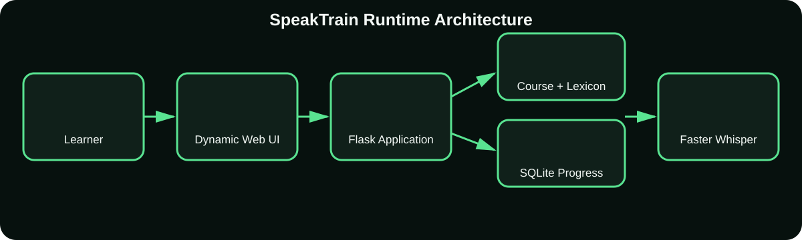
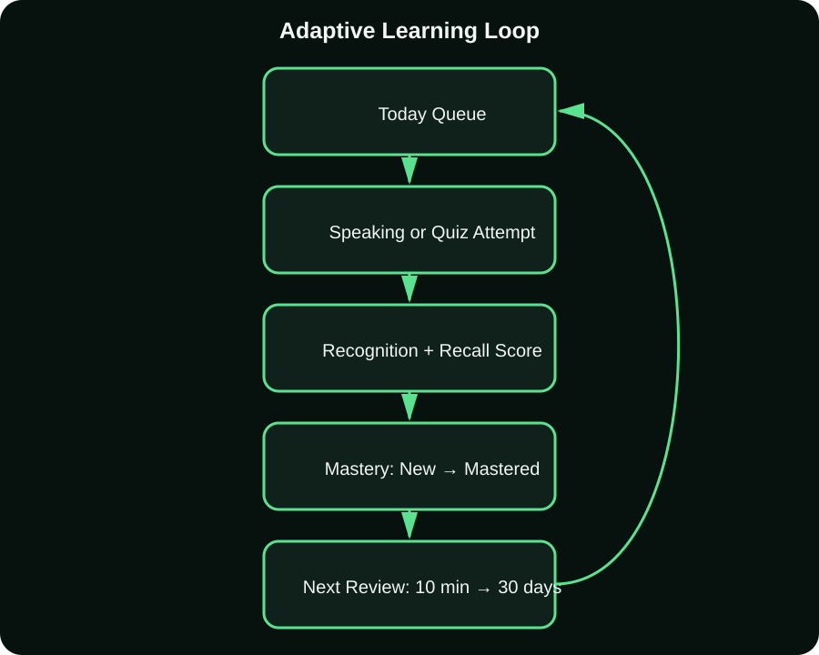
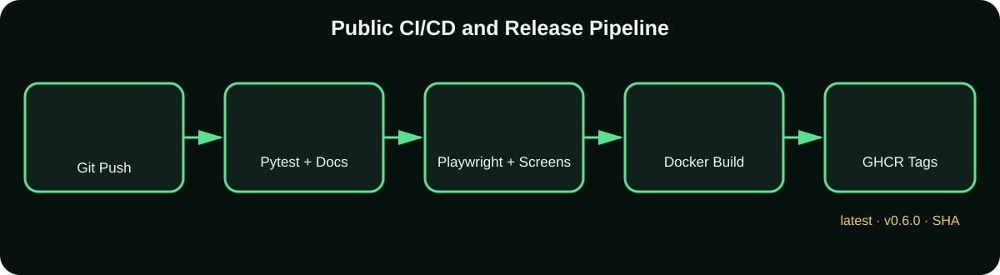

# Architecture

SpeakTrain uses a Flask server, browser-native interface, SQLite persistence, JSON curriculum/lexicon data, and optional local speech engines. The adaptive review table stores one mastery schedule per user and learning item.

The public pipeline validates Python, browser behavior, documentation, D2, security analysis, and the container before publishing versioned images.

Editable D2 sources live in `docs/diagrams/`. Every D2 node references a version-controlled SVG icon from `docs/icons/`.
